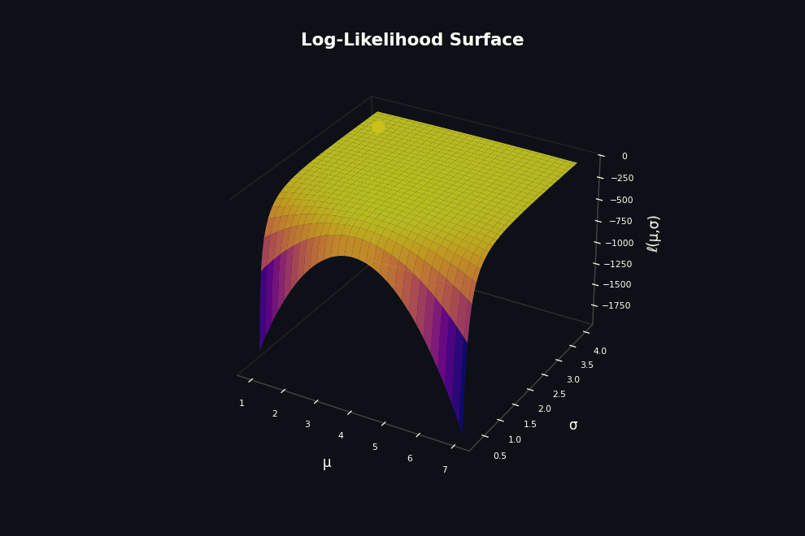
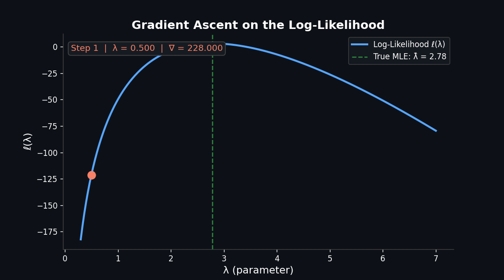

## The Problem: When There's No Formula {background-color="#0d1117"}

::: {.columns}
::: {.column width="57%"}

**Maximum Likelihood Estimation** asks:

> *"What parameter values make my observed data most probable?"*

$$\hat{\theta} = \underset{\theta}{\arg\max} \; \ell(\theta \mid \mathbf{x})$$

- **Simple models** (Poisson, Gaussian) → closed-form solution
- **Complex models** (logistic regression, MNL) → **no formula**
- We need an algorithm to *climb* to the peak

:::
::: {.column width="43%"}

::: {.callout-tip appearance="minimal"}
**The Core Idea**

The log-likelihood is a *surface*.
MLE = finding the **top** of that surface.
:::

<br>

Think of it like hiking in fog — you can't see the peak, but you can always feel which way is uphill.

:::
:::

---

## The Landscape: A Log-Likelihood Surface {background-color="#0d1117"}

::: {.columns}
::: {.column width="42%"}

**Example:** Normal model, estimating $\mu$ and $\sigma$

$$\ell(\mu,\sigma) = -\tfrac{n}{2}\log\sigma^2 - \tfrac{1}{2\sigma^2}\sum(x_i-\mu)^2$$

<br>

- Two parameters → **2D surface**
- The **peak** = MLE $(\hat{\mu},\, \hat{\sigma})$
- The gradient $\nabla \ell$ points uphill — telling us **which way to step**

:::
::: {.column width="58%"}

{width=100%}

:::
:::

---

## The Algorithm: Gradient Ascent {background-color="#0d1117"}

::: {.columns}
::: {.column width="50%"}

**Update rule** — repeat until convergence:

$$\theta^{(t+1)} = \theta^{(t)} + \alpha \cdot \nabla_\theta \, \ell\!\left(\theta^{(t)}\right)$$

| Symbol | Meaning |
|--------|---------|
| $\theta^{(t)}$ | Current parameter estimate |
| $\alpha$ | Learning rate (step size) |
| $\nabla_\theta \ell$ | Gradient — *which way is uphill* |

::: {.fragment}
Stop when the slope flattens: $\|\nabla\ell\| < \varepsilon$
:::

:::
::: {.column width="50%"}

```python
# Gradient Ascent — Poisson MLE
lam   = 0.5    # initial guess
alpha = 0.15   # learning rate

for step in range(100):
    grad = sum(x) / lam - n
    lam  = lam + alpha * grad

    if abs(grad) < 1e-4:
        break

# converges to lam ≈ x̄  (true MLE)
```

:::
:::

---

## Watching It Climb {background-color="#0d1117"}

{width=76% fig-align="center"}

::: {.fragment}
::: {.callout-note appearance="minimal"}
Each dot is one iteration. The algorithm *feels* the gradient and steps uphill — slowing naturally as the slope flattens near $\hat{\lambda} = \bar{x}$.
:::
:::
